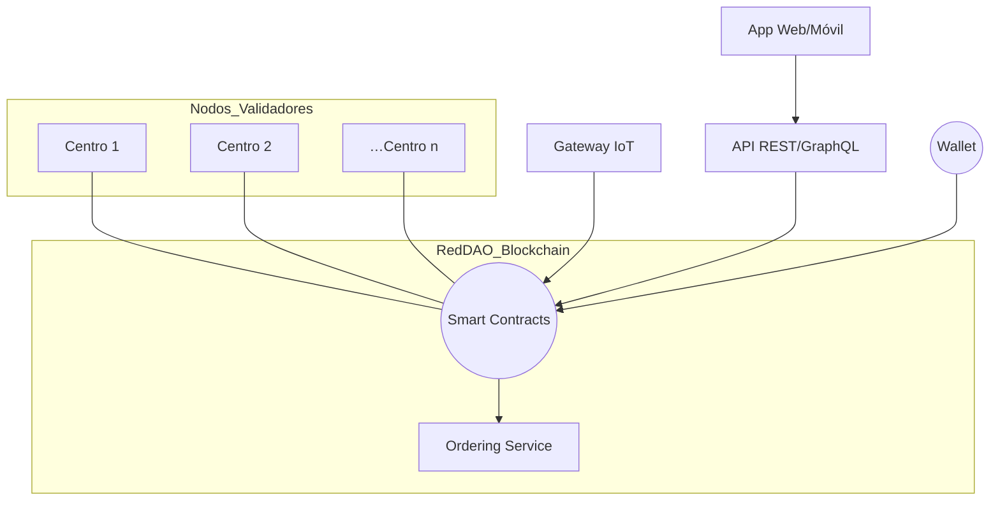
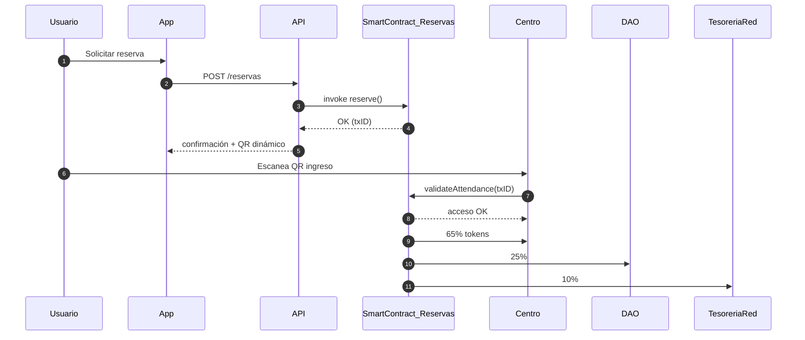
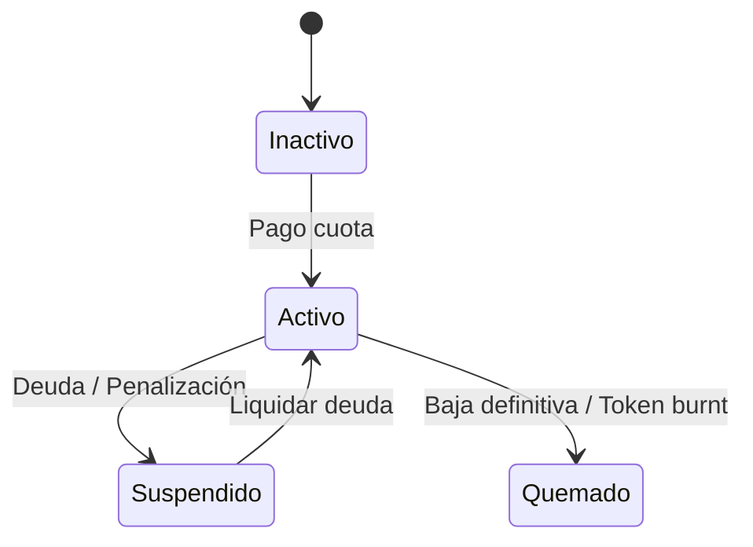
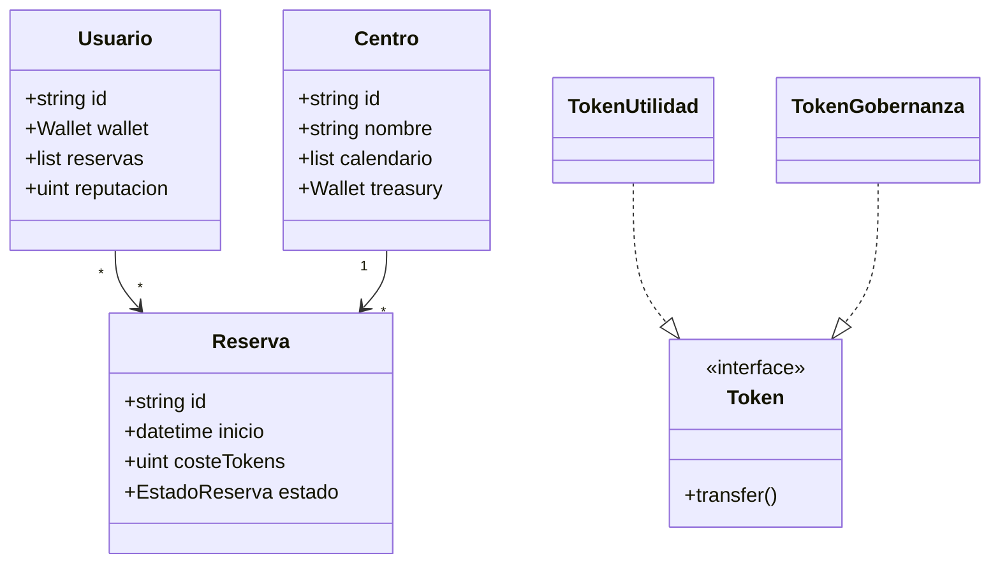
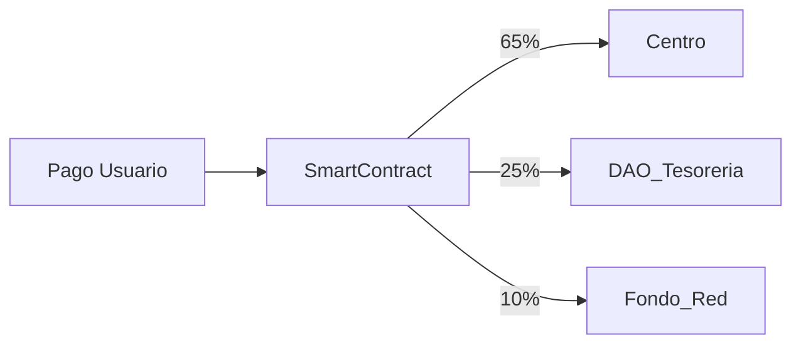
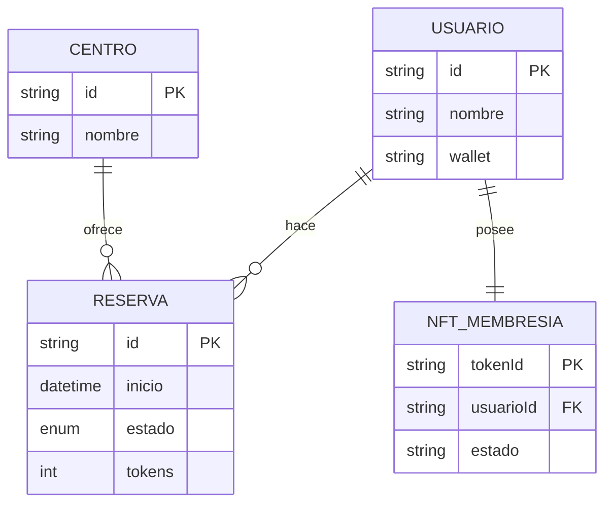

# REDDAO – Plataforma DAO para Centros Deportivos

README técnico–funcional con **TODOS** los diagramas clave (UML, BPMN, ER, etc.) para comprender y construir la solución.

---

## Índice

1. [Introducción](#intro)
2. [Resumen de Valor](#valor)
3. [Requisitos del Sistema](#reqs)
4. [Arquitectura General](#arq)
5. [Diagramas UML](#uml)
   5.1. [Caso de Uso](#uc)
   5.2. [Secuencia](#seq)
   5.3. [Estados](#states)
   5.4. [Clases](#class)
6. [Diagrama de Flujo](#flow)
7. [Diagrama BPMN](#bpmn)
8. [Modelo de Datos (ER)](#er)
9. [Glosario](#gloss)

---

## 1 Introducción <a name="intro"></a>

REDDAO transforma la operación de centros deportivos mediante una **Organización Autónoma Descentralizada** soportada por *blockchain* (Hyperledger Fabric), **IoT** y un modelo de gobernanza tokenizado.

---

## 2 Resumen de Valor <a name="valor"></a>

* Transparencia total 🔍
* Gobernanza comunitaria 🗳️
* Recompensas tokenizadas 🎁
* Financiación descentralizada 💸
* Interoperabilidad entre centros ⚙️

---

## 3 Requisitos del Sistema <a name="reqs"></a>

| Tipo               | Descripción                                                                                                                          |
| ------------------ | ------------------------------------------------------------------------------------------------------------------------------------ |
| **Funcionales**    | Reservas on‑chain, votaciones ponderadas, incentivos, acceso QR/NFT, marketplace, onboarding centros/inversores, compras colectivas. |
| **No Funcionales** | Transparencia, seguridad cripto, escalabilidad (≥5k tx/min), UX móvil/web, cumplimiento GDPR, auditoría continua.                    |

---

## 4 Arquitectura General <a name="arq"></a>



---

## 5 Diagramas UML <a name="uml"></a>

### 5.1 Caso de Uso <a name="uc"></a>

```mermaid
graph TD
    actor Usuario
    actor Centro
    actor Empleado
    actor Inversor
    actor Proveedor
    actor Admin as "REDDAO Business"

    Usuario -- Reserva --> UC1(("Reservar actividad"))
    Usuario -- Pago --> UC2(("Pagar con tokens"))
    Usuario -- Votar --> UC3(("Participar en votación"))

    Centro -- Gestiona --> UC4(("Publicar calendario"))
    Centro -- Valida --> UC5(("Confirmar asistencia"))
    Centro -- Propuesta --> UC6(("Proponer inversión"))

    Empleado -- Recibe --> UC7(("Recibir propinas"))

    Inversor -- Financia --> UC8(("Aportar capital"))
    Inversor -- ROI --> UC9(("Cobrar retorno"))

    Proveedor -- Oferta --> UC10(("Oferta colectiva"))

    Admin -- Despliega --> UC11(("Gestionar contratos"))
```

### 5.2 Secuencia – *Reserva de Clase* <a name="seq"></a>



### 5.3 Diagrama de Estados – *NFT de Membresía* <a name="states"></a>



### 5.4 Diagrama de Clases (Dominio) <a name="class"></a>



---

## 6 Diagrama de Flujo – Distribución de Pagos <a name="flow"></a>



---

## 7 Diagrama BPMN – *Compra Colectiva a Proveedor* <a name="bpmn"></a>

```mermaid
flowchart TD
    start([Inicio]) --> A[Proveedor publica oferta<br/>volumen mínimo]
    A --> B{Centros suman<br/>volumen?}
    B -- No --> C[Esperar más centros]
    C --> B
    B -- Sí --> D[Smart Contract ejecuta compra]
    D --> E[Distribuye productos]
    E --> end([Fin])
```

---

## 8 Modelo Entidad‑Relación <a name="er"></a>



---

## 9 Glosario <a name="gloss"></a>

| Término                 | Definición                                                         |
| ----------------------- | ------------------------------------------------------------------ |
| **DAO**                 | Organización Autónoma Descentralizada.                             |
| **Token de Utilidad**   | Medio de pago por servicios dentro de la red.                      |
| **Token de Gobernanza** | Otorga derechos de voto en decisiones.                             |
| **NFT de Membresía**    | Activo no fungible que identifica al usuario y gestiona su acceso. |
| **Smart Contract**      | Programa inmutable en blockchain que automatiza reglas de negocio. |

---
