```mermaid
graph TD
    subgraph RedDAO_Blockchain
        direction LR
        SC((Smart Contracts)) --> ORD[Ordering Service]
    end

    subgraph Nodos_Validadores
        C1[Centro 1] --- SC
        C2[Centro 2] --- SC
        Cn[…Centro n…] --- SC
    end

    IGW[Gateway IoT] --> SC
    API[API REST / GraphQL] --> SC
    App[App Web / Móvil] --> API
    Wallet((Wallet)) --> SC
```

```mermaid
flowchart TD
    subgraph Actores
        U((Usuario))
        CT((Centro))
        E((Empleado))
        I((Inversor))
        P((Proveedor))
        A((REDDAO Business))
    end

    subgraph "Casos de Uso"
        UC1([Reservar actividad])
        UC2([Pagar con tokens])
        UC3([Participar en votación])
        UC4([Publicar calendario])
        UC5([Confirmar asistencia])
        UC6([Proponer inversión])
        UC7([Recibir propinas])
        UC8([Aportar capital])
        UC9([Cobrar retorno])
        UC10([Oferta colectiva])
        UC11([Gestionar contratos])
    end

    %% Relaciones
    U --> UC1
    U --> UC2
    U --> UC3
    CT --> UC4
    CT --> UC5
    CT --> UC6
    E --> UC7
    I --> UC8
    I --> UC9
    P --> UC10
    A --> UC11
```

```mermaid
sequenceDiagram
    autonumber
    participant U as Usuario
    participant APP as App
    participant API as API
    participant SC as SC_Reservas
    participant C as Centro

    U ->> APP: Solicitar reserva
    APP ->> API: POST /reservas
    API ->> SC: reserve()
    SC -->> API: txId
    API -->> APP: Confirmación + QR
    U ->> C: Escanea QR ingreso
    C ->> SC: validateAttendance(txId)
    SC -->> C: Acceso OK & liquidación
```

```mermaid
stateDiagram-v2
    [*] --> Inactivo
    Inactivo --> Activo: Pago cuota
    Activo --> Suspendido: Deuda/Penalización
    Suspendido --> Activo: Regularizar
    Activo --> Quemado: Baja definitiva
```

```mermaid
flowchart TD
    Start([Inicio]) --> A[Proveedor publica oferta<br/>volumen mínimo]
    A --> B{¿Centros alcanzan<br/>volumen?}
    B -- No --> C[Esperar más centros]
    C --> B
    B -- Sí --> D[Smart Contract ejecuta compra]
    D --> E[Distribuir productos]
    E --> Finish([Fin])
```

# REDDAO – Plataforma DAO para Centros Deportivos

README técnico-funcional con **TODOS** los diagramas clave (UML, BPMN, ER, etc.) para comprender y construir la solución.

---

## Índice

1. [Introducción](#intro)
2. [Resumen de Valor](#valor)
3. [Requisitos del Sistema](#reqs)
4. [Arquitectura General](#arq)
5. [Diagramas UML](#uml)

   1. [Caso de Uso](#uc)
   2. [Secuencia](#seq)
   3. [Estados](#states)
   4. [Clases](#class)
6. [Diagrama de Flujo](#flow)
7. [Diagrama BPMN](#bpmn)
8. [Modelo de Datos (ER)](#er)
9. [Glosario](#gloss)

---

## 1. Introducción 

**REDDAO** transforma la operación de centros deportivos mediante una Organización Autónoma Descentralizada soportada por *blockchain* (Hyperledger Fabric), IoT y un modelo de gobernanza tokenizado.

---

## 2. Resumen de Valor 

* Transparencia total 🔍
* Gobernanza comunitaria 🗳️
* Recompensas tokenizadas 🎁
* Financiación descentralizada 💸
* Interoperabilidad entre centros ⚙️

---

## 3. Requisitos del Sistema 

| Tipo               | Descripción                                                                                                                          |
| ------------------ | ------------------------------------------------------------------------------------------------------------------------------------ |
| **Funcionales**    | Reservas on-chain, votaciones ponderadas, incentivos, acceso QR/NFT, marketplace, onboarding centros/inversores, compras colectivas. |
| **No Funcionales** | Transparencia, seguridad cripto, escalabilidad (≥5 000 tx/min), UX móvil/web, cumplimiento GDPR, auditoría continua.                 |

---

## 4. Arquitectura General 

---

## 5. Diagramas UML 

### 5.1. Caso de Uso 

### 5.2. Secuencia – *Reserva de Clase* 

### 5.3. Diagrama de Estados – *NFT de Membresía* 

### 5.4. Diagrama de Clases (Dominio) 

---

## 6. Diagrama de Flujo – Distribución de Pagos 

---

## 7. Diagrama BPMN – Compra Colectiva a Proveedor 

---

## 8. Modelo Entidad-Relación 

---

## 9. Glosario 

| Término                 | Definición                                                         |
| ----------------------- | ------------------------------------------------------------------ |
| **DAO**                 | Organización Autónoma Descentralizada.                             |
| **Token de Utilidad**   | Medio de pago por servicios dentro de la red.                      |
| **Token de Gobernanza** | Otorga derechos de voto en decisiones.                             |
| **NFT de Membresía**    | Activo no fungible que identifica al usuario y gestiona su acceso. |
| **Smart Contract**      | Programa inmutable en blockchain que automatiza reglas de negocio. |

---
